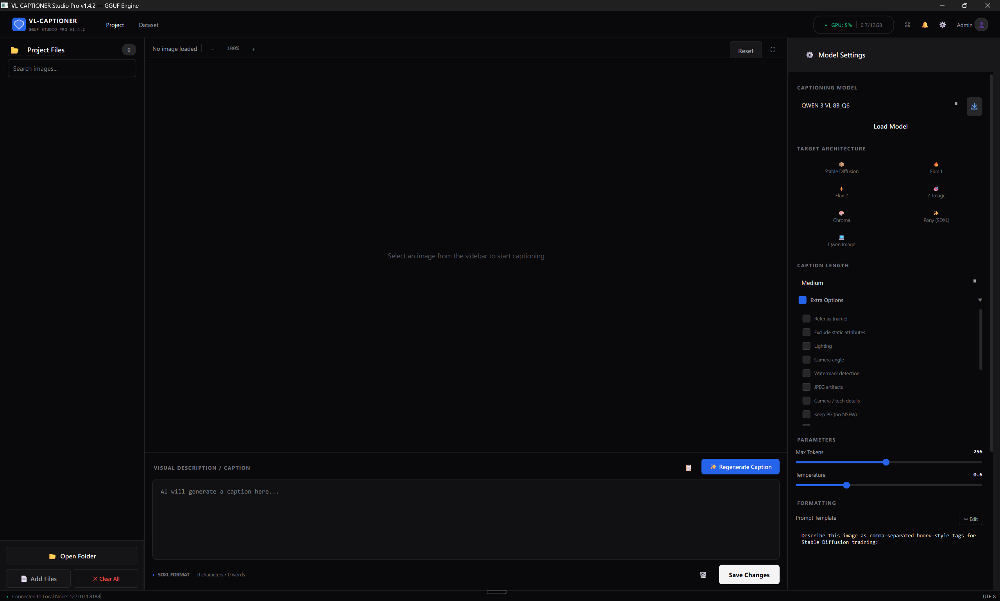

<p align="center">
  
</p>

<h1 align="center">QWEN 3 VL ABL Captioner V1.2.0 — GGUF Engine</h1>
<h3 align="center">Professional GPU-Accelerated Image Captioning for Datasets</h3>

<p align="center">
  
  
  
  
</p>

---

## 🚀 What's New in V1.2.0

This release brings a major overhaul to how captions are generated, focusing on **accuracy, anatomy, and detail** over "storytelling" fluff.

### 🏥 Clinical Precision Mode
We've completely rewritten the prompts for all models (Flux, Stable Diffusion, Pony, etc.). Instead of "cinematic" or "moody" descriptions, the engine now focuses on:
- **Physical Reality**: Exact shapes, textures, and spatial relations.
- **Accurate Anatomy**: Detailed descriptions of bodies and poses without euphemisms.
- **Objective Detail**: "Horses through" the image content, listing exactly what is there.

### 🔞 Uncensored / Adult Detail Option
A new **"Uncensored / Adult Detail"** checkbox in the settings.
When enabled, this injects explicit instructions to describe **all** content (including nudity and adult themes) with full anatomical accuracy, bypassing standard safety refusals. Essential for high-quality dataset training.

---

## ✨ Key Features

- **Clinical Precision**: Using anatomically accurate, objective language instead of "creative writing" style. Designed for training, not storytelling.
- **Universal "Edit" Mode**: Full control via the Edit button to handle any prompt format (JSON, XML, Booru) without needing complex hardcoded "modes".
- **Lean Architecture**: Focused on speed and simplicity. No bloat, just tools that work.
- **Multi-Model Presets**: Pre-configured formats for **Flux 1 & 2**, **Stable Diffusion**, **Pony (SDXL)**, **Z-Image**, and more.
- **Drag & Drop**: Drop images or entire folders directly into the app.
- **Batch Processing**: Caption thousands of images automatically.
- **Smart Model Handling**: Native GGUF support with auto-downloading.
- **Hardware Monitoring**: Real-time GPU VRAM usage display.
- **Safety Controls**: Toggle between "PG" and fully "Uncensored" modes.

---

## 📸 Screenshots

<p align="center">
  
  <br/>
  <em>Main workspace: file browser, image viewer, caption editor, and model settings</em>
</p>

---

## ⚡ Quick Start

### 1. Run Setup
Double-click `setup.bat` to automatically install Python and all necessary dependencies.

### 2. Get Models
You can download models directly inside the app, or place your `.gguf` files in this same folder.
**Recommended:** `Qwen3-VL-8B-Instruct-abliterated-v1.Q6_K.gguf`

### 3. Launch
Double-click `run.bat` to start the captioner.

---

## 📁 Project Structure

```
qwen3vl-captioner/
├── app.py                  # Application entry point
├── run.bat                 # Launch script (Windows)
├── setup.bat               # Automated installer (Windows)
├── requirements.txt        # Python dependencies
├── pyproject.toml          # Project metadata
│
├── engine/                 # Inference backend
│   ├── __init__.py
│   ├── inference.py        # Qwen3VLEngine — GGUF model loading & captioning
│   └── model_downloader.py # HuggingFace model download manager
│
├── gui/                    # PyQt6 user interface
│   ├── __init__.py
│   ├── main_window.py      # Main window orchestrator
│   ├── settings_panel.py   # Right panel — presets, parameters, batch controls
│   ├── file_browser.py     # Left sidebar — thumbnail list with search
│   ├── image_viewer.py     # Center — image preview with zoom controls
│   ├── caption_panel.py    # Bottom — caption display, edit, and save
│   ├── dataset_panel.py    # Dataset table view
│   ├── theme.py            # Dark/light theme color system & QSS stylesheet
│   ├── config.py           # User config persistence (~/.vlcaptioner/)
│   ├── notification_panel.py
│   ├── app_settings_dialog.py
│   └── model_download_manager.py
│
└── assets/
    └── screenshot.png      # GUI screenshot for README
```

---

## 🔧 How It Works

### Engine
The app uses [llama-cpp-python](https://github.com/abetlen/llama-cpp-python) (JamePeng's fork with Qwen3-VL support) to run **GGUF quantized** models directly on your GPU via CUDA. No cloud API, no internet required after model download.

- **Model:** Qwen3-VL 8B Instruct (abliterated variant for uncensored captioning)
- **Quantization:** Q6_K (~6.3 GB) or Q8_0 (~8.1 GB) — excellent quality-to-size ratio
- **Vision encoder:** Separate mmproj file handles image understanding
- **Inference:** GPU-accelerated with streaming token output

### Captioning Workflow

1. **Open Folder** → Select your dataset directory (all images load instantly)
2. **Load Model** → One-click model loading with CUDA auto-detection
3. **Configure** → Choose a target preset (SD, Flux, etc.), adjust length and temperature
4. **Caption** → Click individual images + "Regenerate Caption", or "Batch Caption All" for the entire dataset
5. **Export** → Save all captions as `.txt` sidecar files next to the originals

### Target Presets

| Preset | Use Case |
|--------|----------|
| **Stable Diffusion** | Comma-separated booru-style tags for SD 1.5 / SDXL training |
| **Flux 1** | Natural language descriptions optimized for Black Forest Labs Flux.1 |
| **Flux 2** | Updated format for Flux.2 model training |
| **Z-Image** | Structured captions for Z-Image architecture |
| **Chroma** | Scene descriptions for Chroma model fine-tuning |
| **Pony (SDXL)** | Pony Diffusion V6 tag format with quality markers |
| **Qwen Image** | General-purpose detailed image descriptions |

---

## ⌨️ Manual Installation (Advanced)

If `setup.bat` doesn't work or you prefer manual setup:

```bash
# 1. Create virtual environment
python -m venv .venv
.venv\Scripts\activate

# 2. Install dependencies
pip install -r requirements.txt

# 3. Install llama-cpp-python with CUDA support
# Download the appropriate wheel from:
# https://github.com/JamePeng/llama-cpp-python/releases
pip install llama_cpp_python-0.3.24+cu124.basic-cp312-cp312-win_amd64.whl

# 4. Run
python app.py
```

### Linux / macOS (Experimental)

The GUI is cross-platform (PyQt6) but the setup scripts are Windows-only. For other platforms:

```bash
python3 -m venv .venv
source .venv/bin/activate
pip install -r requirements.txt

# For CUDA on Linux:
CMAKE_ARGS="-DGGML_CUDA=on" pip install llama-cpp-python

# For Metal on macOS:
CMAKE_ARGS="-DGGML_METAL=on" pip install llama-cpp-python

python app.py
```

> **Note:** Linux/macOS support is experimental. The CUDA DLL preloading in `engine/inference.py` is Windows-specific but will be safely skipped on other platforms.

---

## 🛠️ System Requirements

| Component | Minimum | Recommended |
|-----------|---------|-------------|
| **OS** | Windows 10 64-bit | Windows 11 |
| **GPU** | NVIDIA GTX 1070 (8 GB) | NVIDIA RTX 3060+ (12 GB) |
| **VRAM** | 8 GB | 12+ GB |
| **RAM** | 16 GB | 32 GB |
| **Storage** | ~10 GB (model + app) | ~15 GB (both quants) |
| **CUDA** | 12.0 | 12.4 |
| **Python** | 3.11 | 3.12 |

---

## 📝 Caption Output Format

Captions are saved as plain `.txt` files with the same name as the image:

```
my_image.jpg     →  my_image.txt
photo_001.png    →  photo_001.txt
```

This is the standard sidecar format expected by most training tools (Kohya, EveryDream, SimpleTuner, etc.).

---

## 🐛 Troubleshooting

| Issue | Solution |
|-------|----------|
| **"Model not found"** | Place `.gguf` files in the parent directory (one level above `qwen3vl-captioner/`) |
| **"CUDA not available"** | Install [CUDA Toolkit 12.x](https://developer.nvidia.com/cuda-downloads) and restart |
| **Blank image preview** | Fixed in v1.4.2 — Qt image allocation limit raised to handle large files |
| **Slow model loading** | Normal — first load takes 30-60s. Subsequent loads are faster |
| **Out of VRAM** | Use Q6_K instead of Q8_0, or reduce `max_tokens` |
| **"access violation"** | CUDA DLLs not found. Run `run.bat` (sets PATH automatically) |

---

## 🤝 Credits

- **[Qwen3-VL](https://huggingface.co/Qwen)** — Vision-language model by Alibaba DAMO Academy
- **[llama-cpp-python](https://github.com/abetlen/llama-cpp-python)** — Python bindings for llama.cpp
- **[JamePeng's fork](https://github.com/JamePeng/llama-cpp-python)** — Added Qwen3-VL chat handler support
- **[prithi's GGUF quants](https://huggingface.co/prithivMLmods/Qwen3-VL-8B-Instruct-abliterated-v1-GGUF)** — High-quality GGUF model quantizations
- **[PyQt6](https://www.riverbankcomputing.com/software/pyqt/)** — Cross-platform GUI framework

---

## 📄 License

[MIT License](LICENSE) — free to use, modify, and distribute.

---

<p align="center">
  <strong>Made with ❤️ for the AI art community</strong>
  <br/>
  <em>If this tool helps your workflow, consider giving it a ⭐!</em>
</p>
